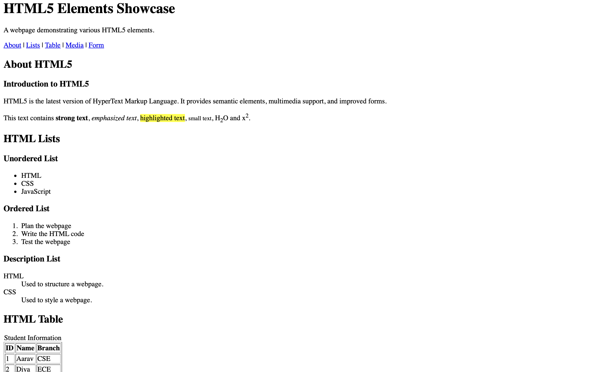
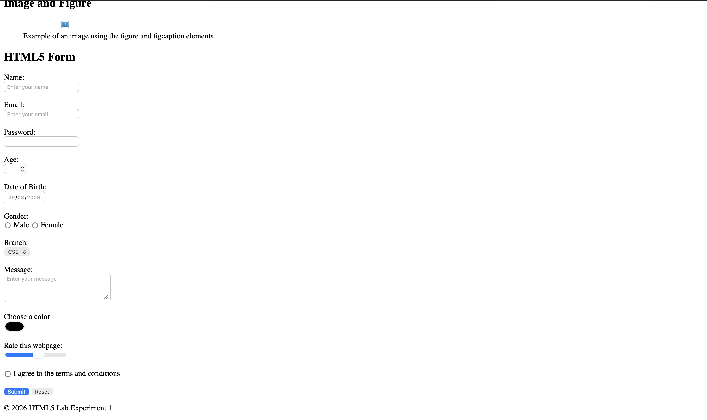

# Lab Experiment 1 – HTML5 Elements Showcase

**Name:** Anusmita Jha  
**SAP ID:** 590015944  
**Course:** B.Tech CSE  
**Subject:** Backend Development  

## 1. Experiment Title

HTML5 Elements Showcase

## 2. Objective

The objective of this experiment is to understand and demonstrate different HTML5 elements by creating a webpage containing semantic elements, navigation, text formatting, lists, tables, images, and forms.

## 3. Introduction

In this experiment, I created a webpage using HTML5 to understand how different HTML elements are used to structure and organize webpage content.

The webpage demonstrates several important HTML5 concepts such as semantic elements, headings, paragraphs, navigation links, lists, tables, images, and forms.

## 4. What I Did

I created an HTML5 webpage called **HTML5 Elements Showcase**.

The webpage contains:

- A header section with a title and description.
- A navigation bar with links to different sections.
- An About section explaining HTML5.
- Different types of HTML lists.
- A student information table.
- An image using the `figure` and `figcaption` elements.
- An HTML5 form with different types of input fields.
- A footer section.

## 5. HTML5 Elements Used

### Semantic Elements

The following semantic elements were used:

- `<header>`
- `<nav>`
- `<main>`
- `<section>`
- `<article>`
- `<figure>`
- `<figcaption>`
- `<footer>`

These elements help organize the webpage into meaningful sections.

### Text Formatting

The webpage demonstrates:

- `<strong>` for strong text
- `<em>` for emphasized text
- `<mark>` for highlighted text
- `<small>` for smaller text
- `` for subscript
- `` for superscript

Examples include H₂O and x².

### Lists

Three types of lists were created:

1. Unordered list
2. Ordered list
3. Description list

### Table

A student information table was created with the following columns:

- ID
- Name
- Branch

### Image and Figure

The `<figure>` and `<figcaption>` elements were used to display an image with a caption.

### HTML5 Form

The form contains different input types, including:

- Text
- Email
- Password
- Number
- Date
- Radio buttons
- Select/dropdown
- Textarea
- Color
- Range
- Checkbox
- Submit button
- Reset button

## 6. What I Learned

From this experiment, I learned how to:

- Create a basic HTML5 webpage.
- Use semantic HTML elements.
- Create navigation links within a webpage.
- Create different types of lists.
- Create and organize data using HTML tables.
- Add images and captions using HTML.
- Create forms using different HTML5 input types.
- Use attributes such as `id`, `name`, `placeholder`, `required`, `min`, and `max`.
- Organize webpage content into different sections.

## 7. Screenshots

### Output Screenshot

## 7. Screenshots

### Screenshot 1

### Screenshot 2

## 8. Conclusion

This experiment helped me understand the basic structure of an HTML5 webpage and the purpose of different HTML5 elements. I learned how to organize content using semantic elements and how to create lists, tables, images, navigation links, and forms.

Overall, this experiment provided practical understanding of HTML5 and helped me build a structured webpage using different HTML elements.