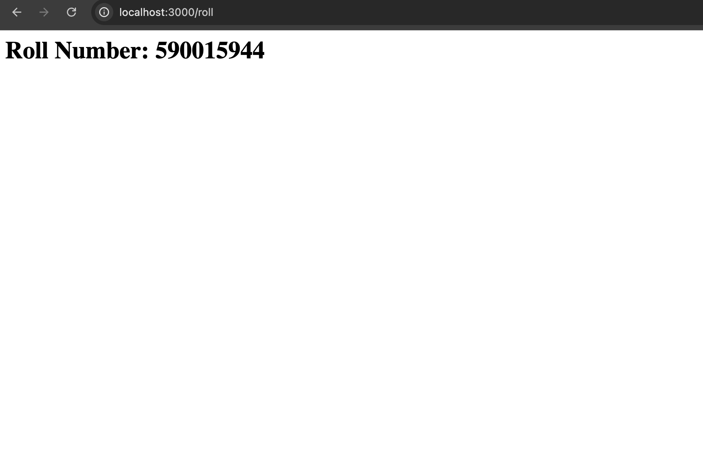
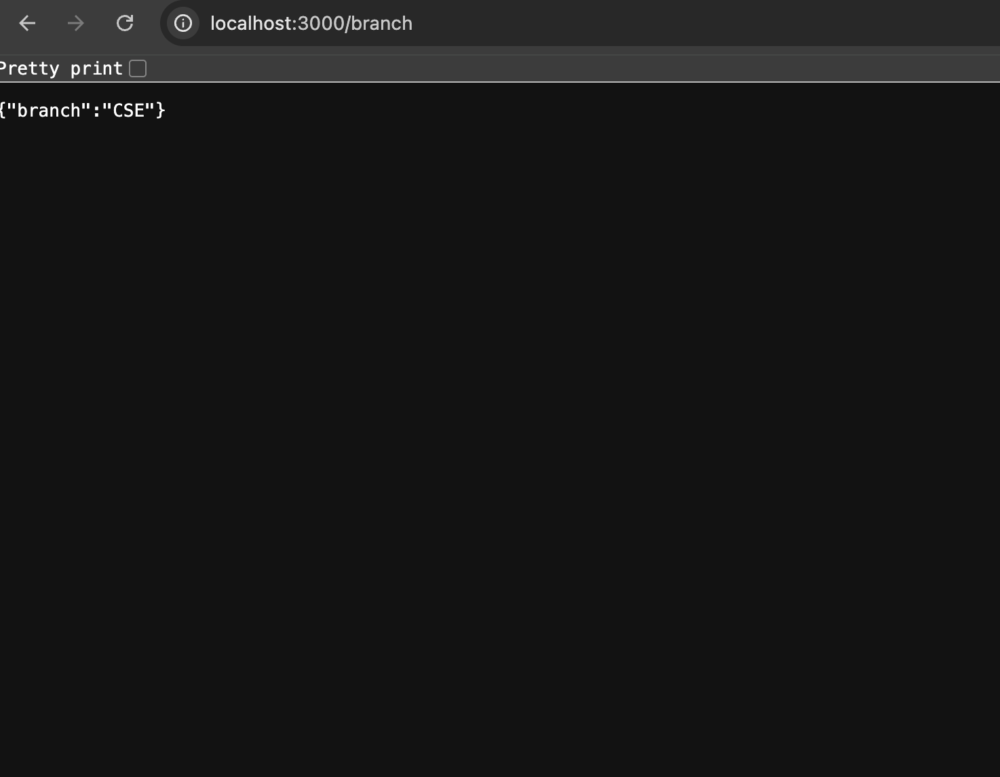
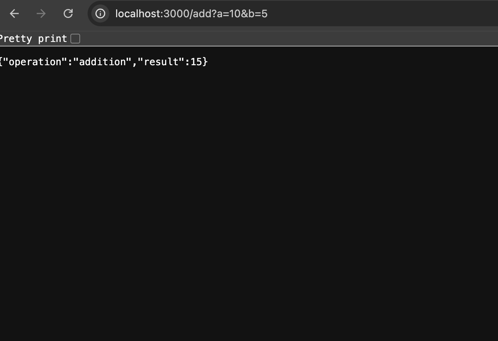
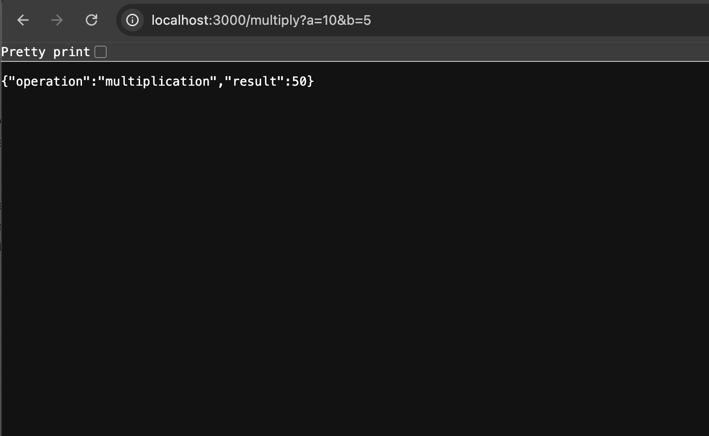
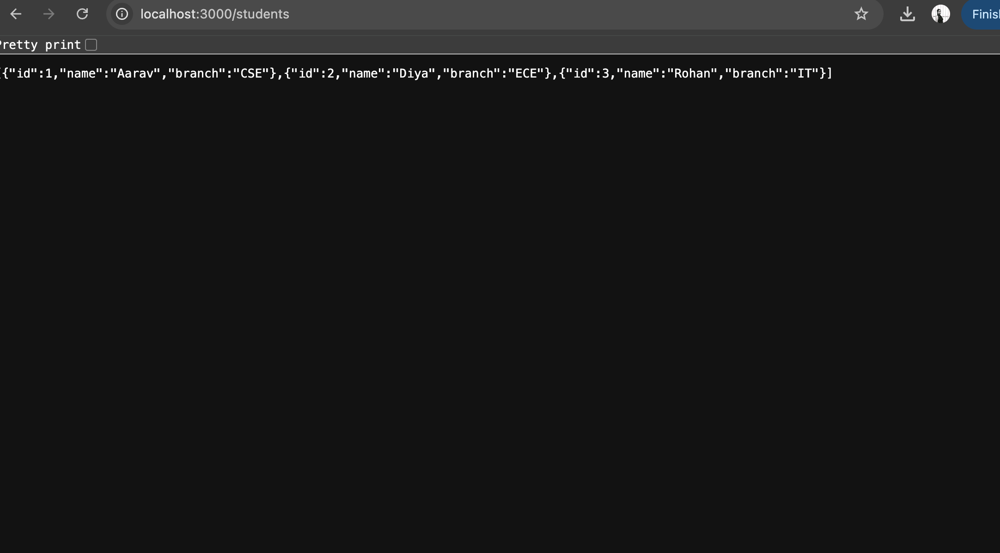
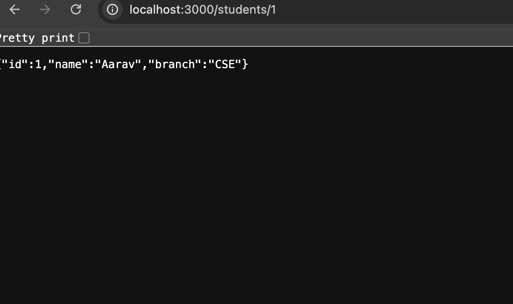
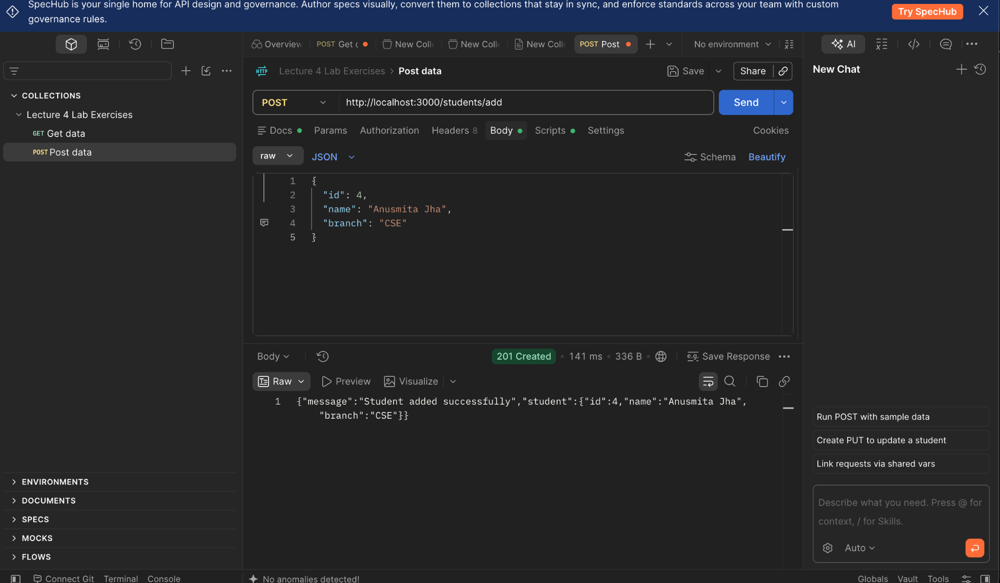
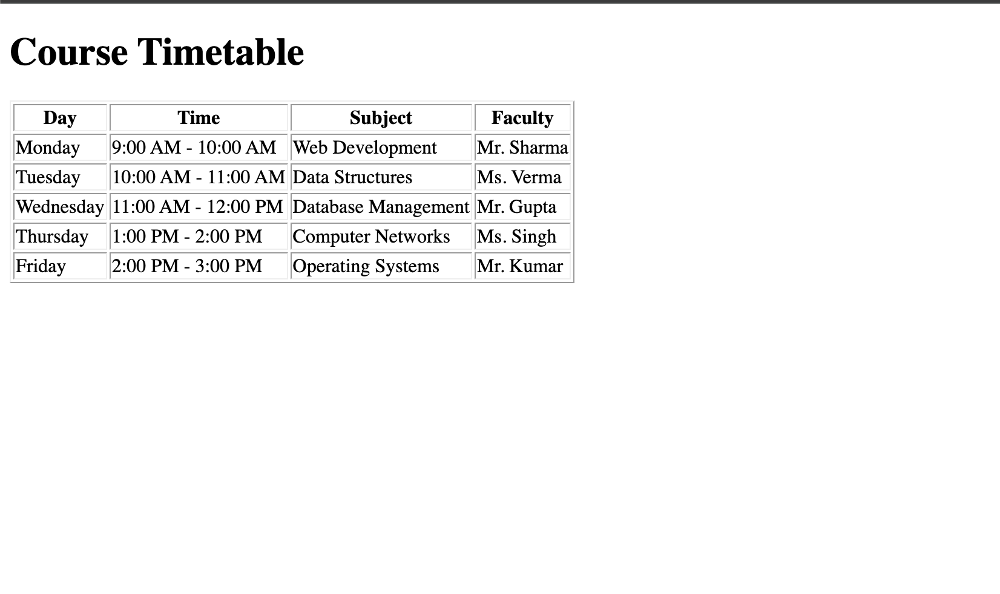
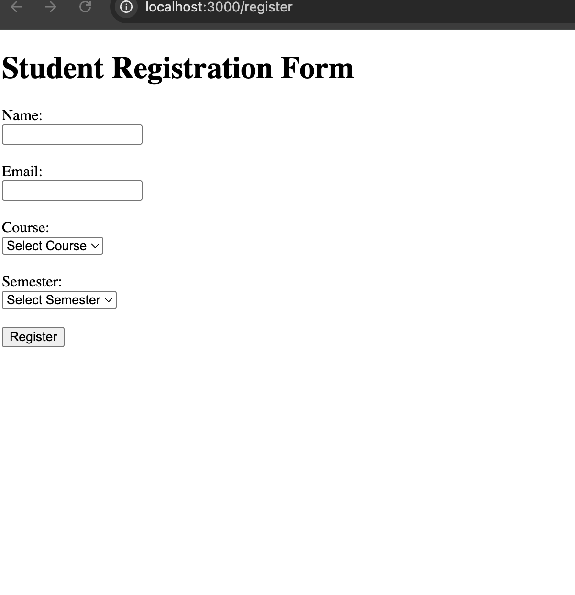
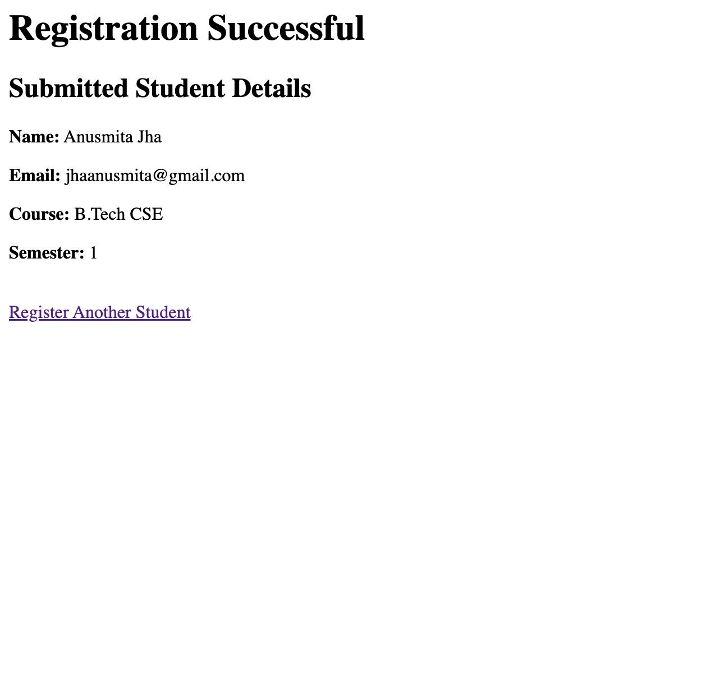

# Lab Experiment 12A – Backend Development

**Name:** Anusmita Jha  
**SAP ID:** 590015944  
**Course:** B.Tech CSE  
**Subject:** Backend Development  

## 1. Experiment Title

Backend Development using Express.js and EJS

## 2. Objective

The objective of this experiment is to understand the basics of backend development using Node.js, Express.js, APIs, query parameters, JSON data, EJS templating, and form handling.

## 3. Introduction

In this experiment, I worked with Express.js to create different backend applications and routes. I learned how a server receives requests and sends appropriate responses.

The experiment contains five tasks covering basic Express routes, a calculator API, student management, EJS-based timetable rendering, and form handling.

## 4. Tasks Performed

### Task 1 – Basic Server

In this task, I created a basic Express.js server with different routes.

The following routes were implemented:

- `/name` – returns the name as plain text.
- `/roll` – returns the roll number as an HTML heading.
- `/branch` – returns the branch information as JSON.

This helped me understand how Express routes can return different types of responses.

### Task 2 – Calculator API

In this task, I created a calculator API using Express.js and query parameters.

The API supports:

- Addition
- Subtraction
- Multiplication
- Division
- Modulus
- Power

The values of `a` and `b` are received through query parameters.

For example:

`/add?a=10&b=5`

The division route also checks whether the second number is zero and returns an error message when division by zero is attempted.

### Task 3 – Student Management

In this task, I created a simple Student Management API.

A student contains:

- ID
- Name
- Branch

The following routes were implemented:

- `GET /students` – returns all students.
- `GET /students/:id` – returns a particular student using its ID.
- `POST /students/add` – adds a new student.

The application uses `express.json()` to process JSON request bodies.

A 404 response is returned when the requested student does not exist, while a 201 response is returned when a new student is successfully added.

### Task 4 – EJS Timetable

In this task, I used EJS as the view engine with Express.js.

A timetable was created containing:

- Day
- Time
- Subject
- Faculty

The `/timetable` route renders the `timetable.ejs` file and passes the timetable data to the view.

The EJS template uses a loop to display each timetable entry dynamically.

### Task 5 – Form Handling

In this task, I created a student registration form using EJS and Express.js.

The form collects:

- Name
- Email
- Course
- Semester

The form sends data using the POST method to `/register`.

The application uses `express.urlencoded({ extended: true })` to read the submitted form data.

After submission, the entered student details are displayed on a result page using the `result.ejs` template.

## 5. Technologies Used

- Node.js
- Express.js
- JavaScript
- EJS
- HTML
- JSON
- REST API concepts

## 6. Concepts Learned

Through this experiment, I learned:

- How to create an Express.js server.
- How to define GET and POST routes.
- How to send plain text, HTML, and JSON responses.
- How to use query parameters.
- How to use route parameters.
- How to process JSON request bodies.
- How to create a simple REST API.
- How to handle different HTTP response statuses.
- How to use EJS as a template engine.
- How to pass data from an Express server to an EJS template.
- How to handle HTML form submissions.
- How to process URL-encoded form data.

## 7. What I Learned

This experiment helped me understand how backend applications work using Express.js. I learned how different routes can perform different tasks and how data can be received from clients using query parameters, route parameters, JSON requests, and HTML forms.

I also learned how EJS can be used to generate dynamic HTML pages from server-side data. The Student Management and Calculator API tasks helped me understand the basic structure of APIs, while the timetable and registration tasks helped me understand server-side rendering and form handling.

## 8. Screenshots

### Task 1 – Basic Server

#### Name Route

#### Roll Number Route

#### Branch Route

### Task 2 – Calculator API

#### Addition

#### Multiplication

### Task 3 – Student Management

#### All Students

#### Single Student

#### Add Student

### Task 4 – EJS Timetable

### Task 5 – Form Handling

#### Registration Form

#### Registration Result

## 9. Conclusion

This experiment provided practical experience with backend development using Express.js. I learned how to create servers, define routes, build APIs, work with JSON data and query parameters, render dynamic pages using EJS, and process form submissions.

Overall, the experiment helped me understand the basic workflow of an Express.js backend and how it communicates with the client through different types of requests and responses.